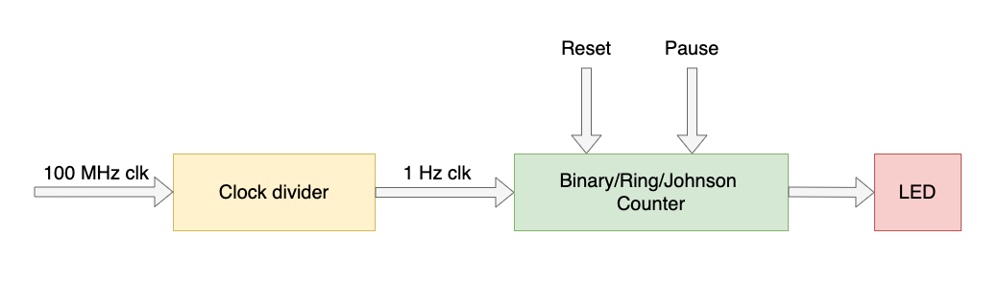

# ECE5 24L Fall 2021
**California State University, Northridge**  
**Department of Electrical and Computer Engineering**  

# Lab 1 - Exploring Xilinx Vivado IDE and Development Board

## Objective

After completing this lab, students will be able to:
- Create a Vivado project sourcing HDL model(s) and targeting a specific FPGA device located on the development board
- Use the provided Xilinx Design Constraint (XDC) file to constrain the pin locations
- Simulate the design using the Vivado simulator
- Synthesize and implement the design 
- Generate the bitstream
- Configure FPGA directly and through onboard flash memory

## Requirements

The following material is required to complete the lab:
- Xilinx Vivado 2019.1
- Zedboard development board
- USB Programming cable

## References

- Xilinx FPGA datasheets (available at http://www.xilinx.com)
- Software Manual (available at http://www.support.xilinx.com)

## Introduction

This lab introduces the Zedboard, Xilinx Vivado IDE, and their features. You will design a simple 8 bit counter to download to the Zedboard. The timing of the counter is controlled by the onboard clock signal. There is also a reset button, direction, and a pause switch to add more features to the counter. Furthermore the 8 bit counter should light up the LEDs on the development board. As the clock frequency generated by the onboard oscillator has a high frequency of 100 MHz and consequently the counts on the LEDs cannot be observed therefore the clock needs to be slowed down. A second counter needs to be designed to slow down the frequency to roughly about 1 Hz so switching can be observed. Figure 1 shows the block diagram of the design used in this lab. 
 

Figure 1.1: Top level block diagram of the counter design

:question: **Question 1:** Explain what the constraint file is and how it helps you use the resources on FPGA development board? Explain how you add a constraint file to an existing design?

:question: **Question 2:** How do you access the FPGA resource information for any design? i.e. number of flip flops or LUTs?

:question: **Question 3:** How do you observe real time delays on simulation waveforms that is generated by Xilinx Vivado software? How do you select between different types of simulation in ISE software and what are the differences?

:question: **Question 4:** What file is used to program the FPGA? Where is this file located?

## Procedure

Follow the procedure given below and answer the questions:

:question: **Question 5:** What is the input clock frequency to the FPGA?

:question: **Question 6:** Assuming the LED switching frequency is to be 1 Hz, how can you make the FPGA input clock faster or slower than 1 Hz?

:point_right: **Task 1:** Design two counters: frequency divider counter that slows down the input clock frequency to the FPGA and 8 bit binary counter that lights up the LEDs. Make a new project and import all the files to your project.

:question: **Question 7:** What is the contents of the constraint file to use development board resources such as LEDs, sliding switches, clock, and push buttons?

:point_right: **Task 2:** Synthesize VHDL code and make sure it is error free.

:point_right: **Task 3:** Add location constraints to your design in order to use Zedboard development board pins. Connect the LEDs to the 8 bit counter outputs, and slide switches to reset, direction, and pause inputs to the 8 bit counter.

:point_right: **Task 4:** Modify your code to convert the counter to a full 8-bit BCD counter, Johnson counter, Gray Code counter, Ring counter and 8 bit Fibonacci counter and verify the hardware. 

:point_right: **Task 5:** There are 6 different counters you have designed. Use a multiplexer with select lines connected to the sliding switches to switch among all the counters. For instance, setting the switch to 001 selects binary counter, 010 selects BCD counter, and so on. 

:point_right: **Task 6:** Prove your design works by simulating your design.
